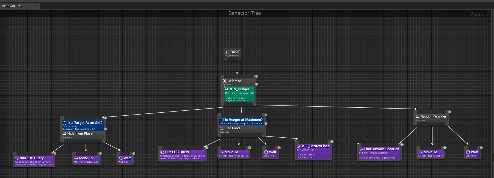

# ProjectAI

Project for the course Introduction to AI with Blueprints, in the Unreal Engine Academy.

##Details

Using Blueprint Visual Scripting system, the final result will be an AI agent that senses the world around them, considers what to do based upon those senses, and navigates the world intelligently in order to reach a specified goal.
The project utilize Navigation, Perception, Behavior Trees and the Environment Questy System (EQS).

##Image

