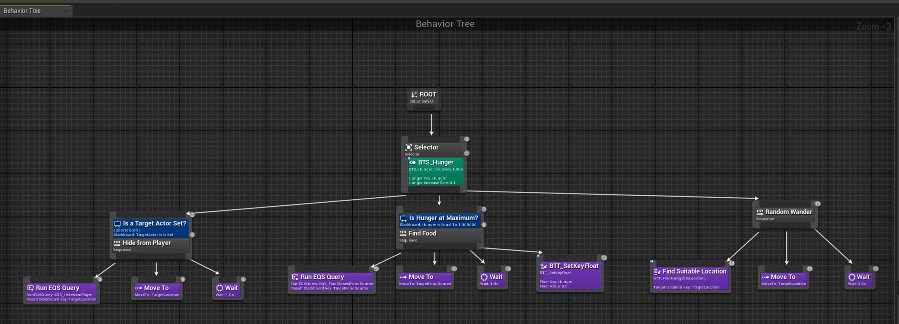
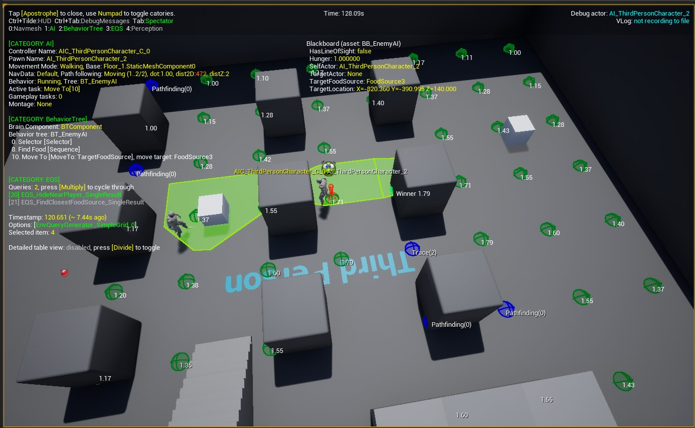

# ProjectAI

##Details

Project for the course with the Unreal Engine Academy, creating a simple AI that is looking for food (the white cube), but only if he's hide from the player (if the player is not in the eyesight of the AI); if not, he's cover in a position genereted via EQS query.

Using Blueprint Visual Scripting system, the final result will be an AI agent that senses the world around them, considers what to do based upon those senses, and navigates the world intelligently in order to reach a specified goal.
The project utilize Navigation, Perception, Behavior Trees and the Environment Questy System (EQS).

##Image

###Behavior tree

###Debug AI behavior

###Video Link
